outlierMBC
================
Ultán P. Doherty
2024-06-26

# Outlier Identification for Model-Based Clustering

- `ombc_gmm` - Identify multivariate outliers while clustering data with
  a Gaussian mixture model.
- `ombc_lcwm` - Identify covariate and/or response outliers while
  fitting a linear cluster-weighted model to the data.
- `simulate_gmm` - Simulate data from a Gaussian mixture model with
  multivariate outliers.
- `simulate_lcwm` - Simulate data from a linear cluster-weighted model
  with covariate and/or response outliers.

## Mixture Models

``` r
gmm_p2g3 <- simulate_gmm(
  n = c(2000, 1000, 1000),
  mu = list(c(-1, 0), c(+1, -1), c(+1, +1)),
  sigma = list(diag(c(0.2, 4 * 0.2)), diag(c(0.2, 0.2)), diag(c(0.2, 0.2))),
  outlier_num = 40,
  seed = 123,
  crit_val = 0.9999,
  unif_range_multiplier = 1.5
)

ombc_gmm_p2g3 <- ombc_gmm(
  gmm_p2g3[, 1:2],
  comp_num = 3,
  max_out = 80,
  mnames = "VVV",
  seed = 123
)
```

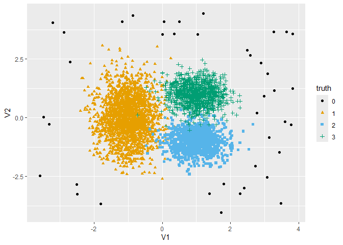

## Linear Cluster-Weighted Models

### Single Component, Response Outliers

``` r
lcwm_p1g1_y_only <- simulate_lcwm(
  n = 1000,
  mu = list(c(1)),
  sigma = list(as.matrix(0.1)),
  beta = list(c(1, 1)),
  error_sd = 0.5,
  outlier_num = 20,
  outlier_type = "y_only",
  seed = 123,
  crit_val = 0.9999
)

ombc_lcwm_p1g1_y_only <- ombc_lcwm(
  xy = lcwm_p1g1_y_only,
  x = lcwm_p1g1_y_only$X1,
  y_formula = Y ~ X1,
  comp_num = 1,
  max_out = 40,
  mnames = "V",
  seed = 123,
  outlier_type = "y_only"
)
```

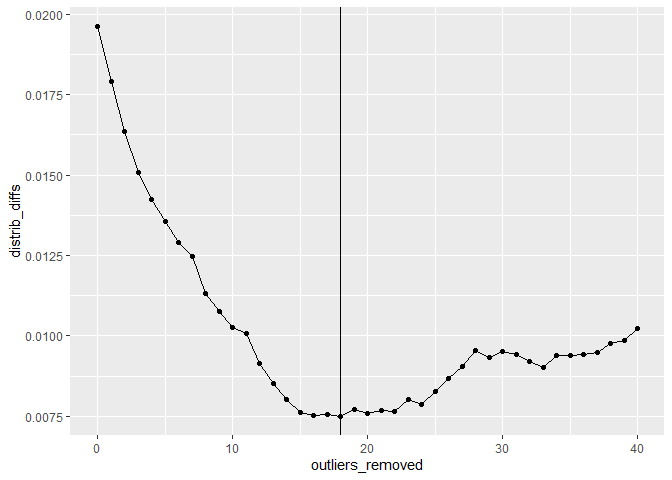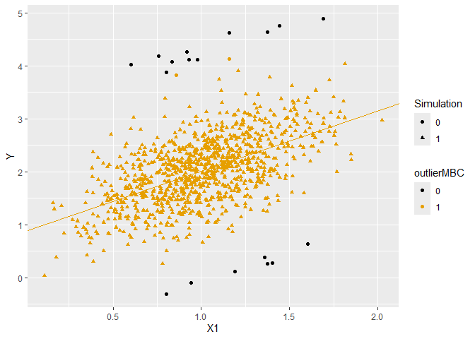

### Single Component, Covariate Outliers

``` r
lcwm_p1g1_x_only <- simulate_lcwm(
  n = 1000,
  mu = list(c(1)),
  sigma = list(as.matrix(0.1)),
  beta = list(c(1, 1)),
  error_sd = 0.5,
  outlier_num = 20,
  outlier_type = "x_only",
  seed = 123,
  crit_val = 0.9999
)

ombc_lcwm_p1g1_x_only <- ombc_lcwm(
  xy = lcwm_p1g1_x_only,
  x = lcwm_p1g1_x_only$X1,
  y_formula = Y ~ X1,
  comp_num = 1,
  max_out = 40,
  mnames = "V",
  seed = 123,
  outlier_type = "x_only"
)
```

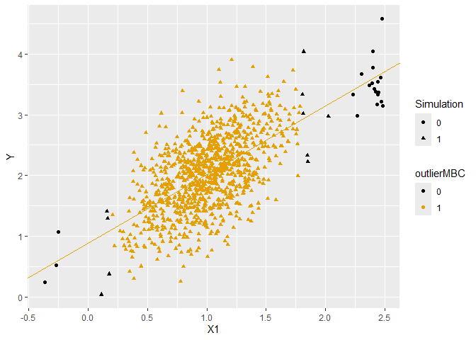

### Single Component, Combined Outliers

``` r
lcwm_p1g1_x_and_y <- simulate_lcwm(
  n = 1000,
  mu = list(c(1)),
  sigma = list(as.matrix(0.1)),
  beta = list(c(1, 1)),
  error_sd = 0.5,
  outlier_num = 20,
  outlier_type = "x_and_y",
  seed = 123,
  crit_val = 0.9999
)

ombc_lcwm_p1g1_x_and_y <- ombc_lcwm(
  xy = lcwm_p1g1_x_and_y,
  x = lcwm_p1g1_x_and_y$X1,
  y_formula = Y ~ X1,
  comp_num = 1,
  max_out = 40,
  mnames = "V",
  seed = 123,
  outlier_type = "x_and_y"
)
```

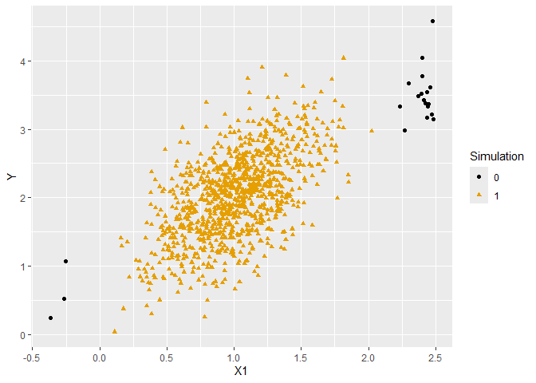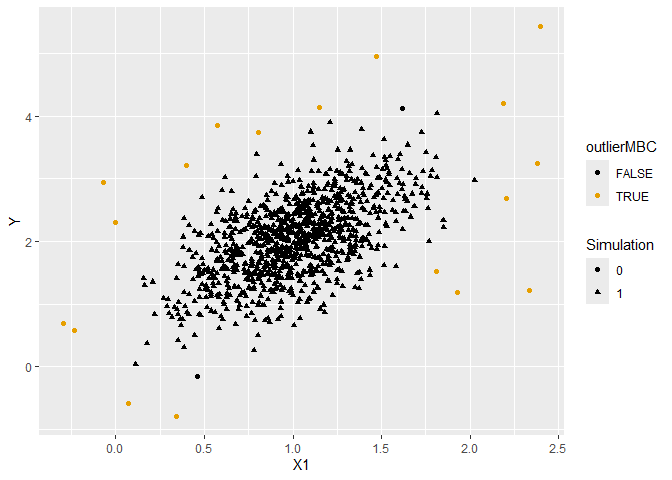

### Two-Component, Response Outliers

``` r
lcwm_p1g2_y_only <- simulate_lcwm(
  n = c(1000, 1000),
  mu = list(c(-1), c(+1)),
  sigma = list(as.matrix(0.2), as.matrix(0.2)),
  beta = list(c(1, 0), c(1, 3)),
  error_sd = c(1, 1),
  outlier_num = c(25, 25),
  outlier_type = "y_only",
  seed = 123,
  crit_val = 0.9999,
  range_multipliers = c(2, 2)
)

ombc_lcwm_p1g2_y_only <- ombc_lcwm(
  xy = lcwm_p1g2_y_only,
  x = lcwm_p1g2_y_only$X1,
  y_formula = Y ~ X1,
  comp_num = 2,
  max_out = 100,
  mnames = "V",
  seed = 123,
  outlier_type = "y_only"
)
```

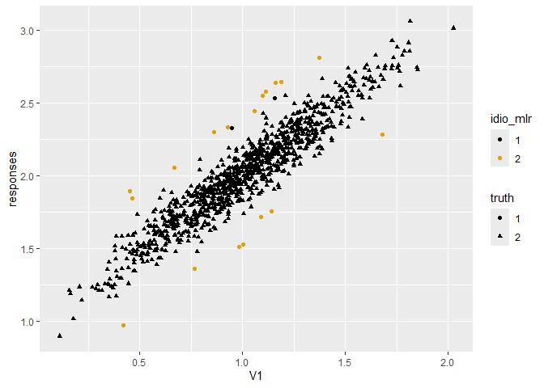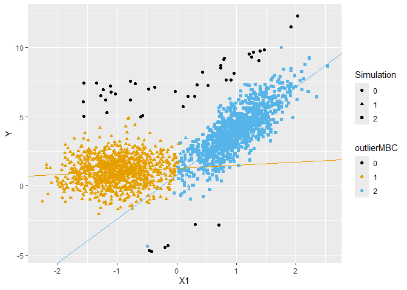

### Two-Component, Covariate Outliers

``` r
lcwm_p1g2_x_only <- simulate_lcwm(
  n = c(1000, 1000),
  mu = list(c(-1), c(+1)),
  sigma = list(as.matrix(0.2), as.matrix(0.2)),
  beta = list(c(1, 0), c(1, 3)),
  error_sd = c(1, 1),
  outlier_num = c(25, 25),
  outlier_type = "x_only",
  seed = 123,
  crit_val = 0.9999,
  range_multipliers = c(2, 2)
)

ombc_lcwm_p1g2_x_only <- ombc_lcwm(
  xy = lcwm_p1g2_x_only,
  x = lcwm_p1g2_x_only$X1,
  y_formula = Y ~ X1,
  comp_num = 2,
  max_out = 100,
  mnames = "V",
  seed = 123,
  outlier_type = "x_only"
)
```

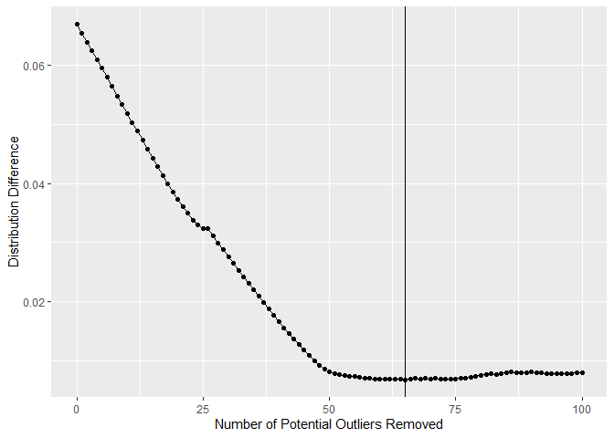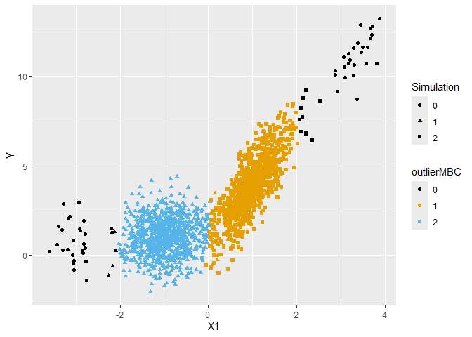

### Two-Component, Combined Outliers

``` r
lcwm_p1g2_x_and_y <- simulate_lcwm(
  n = c(1000, 1000),
  mu = list(c(-1), c(+1)),
  sigma = list(as.matrix(0.2), as.matrix(0.2)),
  beta = list(c(1, 0), c(1, 3)),
  error_sd = c(1, 1),
  outlier_num = c(25, 25),
  outlier_type = "x_and_y",
  seed = 123,
  crit_val = 0.9999,
  range_multipliers = c(2, 2)
)

ombc_lcwm_p1g2_x_and_y <- ombc_lcwm(
  xy = lcwm_p1g2_x_and_y,
  x = lcwm_p1g2_x_and_y$X1,
  y_formula = Y ~ X1,
  comp_num = 2,
  max_out = 100,
  mnames = "V",
  seed = 123,
  outlier_type = "x_and_y"
)
```

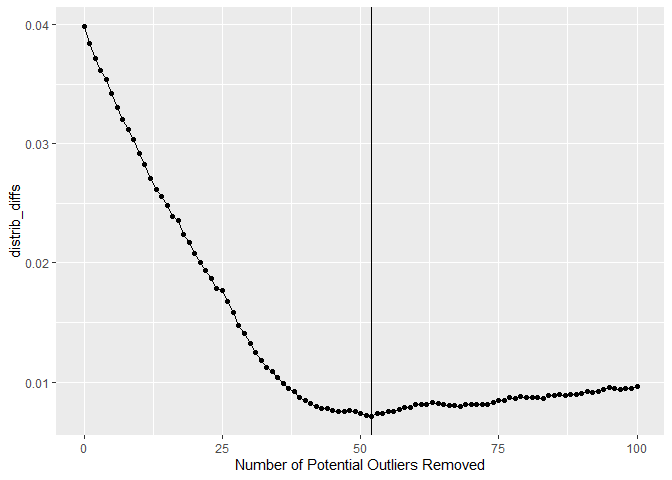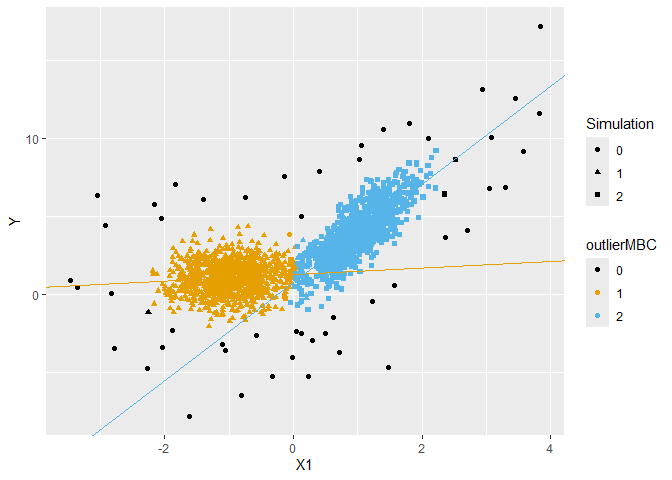
