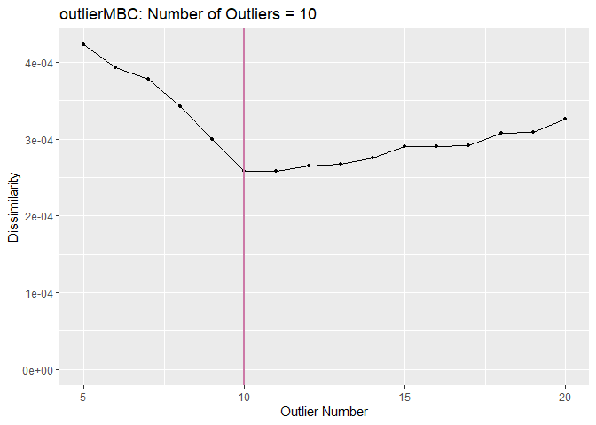
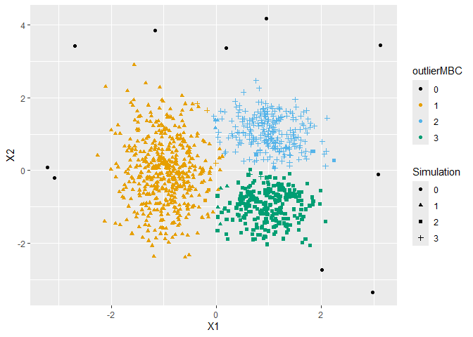
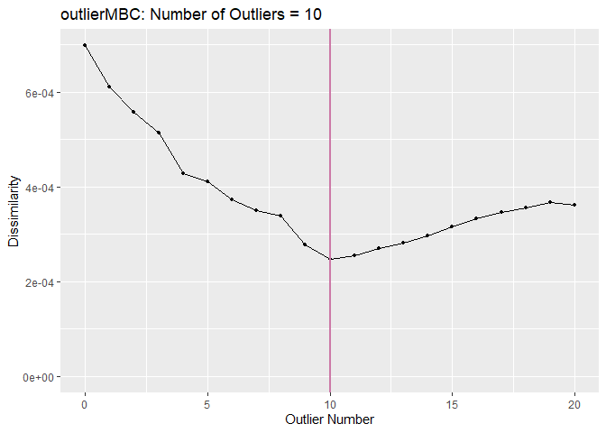
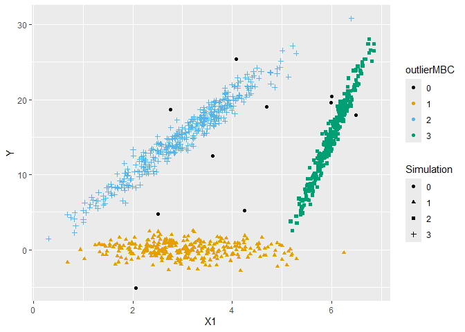

outlierMBC
================
Ultán P. Doherty
2024-06-26

# Outlier Identification for Model-Based Clustering

## Gaussian Mixture Models

``` r
gross_gmm_k3n1000o10 <- find_gross(gmm_k3n1000o10[, 1:2], max_out = 20)

ombc_gmm_k3n1000o10 <- ombc_gmm(
  gmm_k3n1000o10[, 1:2], comp_num = 3, max_out = 20, gross_outs = gross_gmm_k3n1000o10$gross_bool
)

print(ombc_gmm_k3n1000o10)
```

    ## Starting number of data points:   1010 
    ## Maximum number of outliers:   20 
    ## Number of gross outliers:     5 
    ## Final number of outliers:     10 (minimum dissimilarity)

``` r
plot(ombc_gmm_k3n1000o10)
```

<!-- -->

``` r
gmm_k3n1000o10 |>
  mutate("ombc" = as.factor(ombc_gmm_k3n1000o10$labels), G = as.factor(G)) |>
  ggplot(aes(x = X1, y = X2, colour = ombc, shape = G)) +
  geom_point() +
  labs(colour = "outlierMBC", shape = "Simulation") +
  ggokabeito::scale_colour_okabe_ito(order = c(9, 1:3))
```

<!-- -->

## Linear Cluster-Weighted Models

``` r
gross_lcwm_k3n1000o10 <- find_gross(lcwm_k3n1000o10[, 1:2], max_out = 20)

ombc_lcwm_k3n1000o10 <- ombc_gmm(
  lcwm_k3n1000o10[, 1:2], comp_num = 3, max_out = 20, gross_outs = gross_lcwm_k3n1000o10$gross_bool
)

print(ombc_lcwm_k3n1000o10)
```

    ## Starting number of data points:   1010 
    ## Maximum number of outliers:   20 
    ## Number of gross outliers:     0 
    ## Final number of outliers:     10 (minimum dissimilarity)

``` r
plot(ombc_lcwm_k3n1000o10)
```

<!-- -->

``` r
lcwm_k3n1000o10 |>
  mutate("ombc" = as.factor(ombc_lcwm_k3n1000o10$labels), G = as.factor(G)) |>
  ggplot(aes(x = X1, y = Y, colour = ombc, shape = G)) +
  geom_point() +
  labs(colour = "outlierMBC", shape = "Simulation") +
  ggokabeito::scale_colour_okabe_ito(order = c(9, 1:3))
```

<!-- -->
